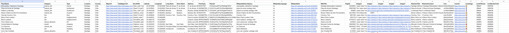
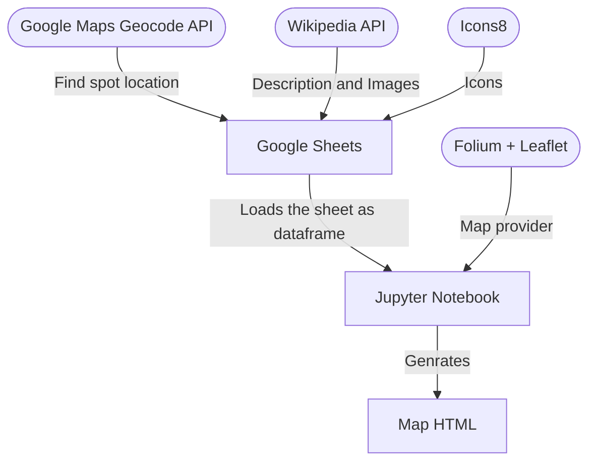

# JupyterMapIconsBodge

✨**Gambiarra**🤌 geradora de pontos de interesse em mapa.

https://alrestevam.github.io/JupyterMapIconsBodge/

```mermaid
flowchart TD
    A[Google Sheets]
    B([Google Maps Geocode API]) -->|Find spot location| A
    C([Wikipedia API]) -->|Description and Images|A
    D([Icons8]) -->|Icons|A
    E[Jupyter Notebook]
    A-->|Loads the sheet as dataframe| E
    F([Folium + Leaflet])-->|Map provider|E
    G[Map HTML]
    E-->|Genrates|G
```

